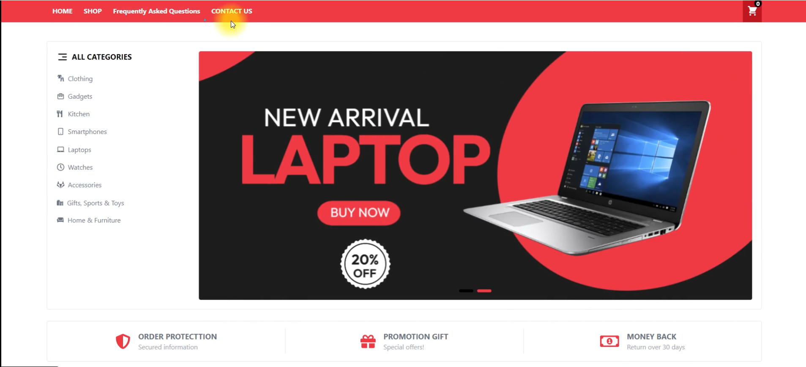

<div align="center">


# 🛒 EazyShop - Modern E-Commerce Platform

</div>

<div align="center">

[](https://your-demo-link.com)
[](LICENSE)
[](CONTRIBUTING.md)


*A Full-Stack E-Commerce Solution Built with MERN Stack*

</div>

---

## 🌟 Overview

EazyShop is a comprehensive e-commerce platform that delivers a seamless shopping experience for both customers and administrators. Built with modern web technologies, it features real-time inventory management, secure payment processing, and an intuitive admin dashboard.

## 🎯 Key Features

### 🛍️ **Customer Experience**
- **Product Catalog**: Browse through organized categories with advanced filtering
- **Smart Search**: Find products with keyword-based search functionality  
- **Shopping Cart**: Add, remove, and manage items with persistent cart storage
- **Secure Checkout**: Stripe-powered payment processing with order tracking
- **User Profiles**: Account management with order history and profile updates
- **Product Reviews**: Rate and review products with star ratings

### 🔧 **Admin Dashboard**
- **Inventory Management**: Add, update, and delete products with image uploads
- **Order Processing**: Track and update order statuses from processing to delivery
- **User Management**: View and manage user accounts and permissions
- **Analytics**: Monitor sales, revenue, and customer insights
- **Review Moderation**: Manage product reviews and ratings

### 🎨 **User Interface**
- **Responsive Design**: Optimized for desktop, tablet, and mobile devices
- **Modern UI**: Clean interface built with Tailwind CSS and Framer Motion
- **Real-time Updates**: Dynamic content updates without page refreshes
- **Dark/Light Theme**: Multiple theme options for user preference

## 🛠️ Technology Stack

### **Frontend**
- **React 18.2.0** - Modern UI library with hooks and concurrent features
- **Redux Toolkit 1.9.1** - State management with less boilerplate
- **Redux 4.2.0** - Predictable state container
- **Redux Thunk 2.4.2** - Async action creators
- **React Router DOM 6.4.3** - Client-side routing and navigation
- **React Redux 8.0.5** - Official React bindings for Redux
- **Tailwind CSS 3.2.4** - Utility-first CSS framework
- **Framer Motion 7.6.12** - Production-ready motion library
- **Axios 1.2.0** - Promise-based HTTP client
- **React Icons 4.6.0** - Popular icon library
- **React Helmet 6.1.0** - Document head management
- **React Toastify 9.1.1** - Toast notifications
- **Headless UI 1.7.7** - Unstyled accessible components
- **Swiper 8.4.5** - Modern touch slider
- **RC Slider 9.6.5** - React slider component

### **Payment Integration**
- **Stripe 11.5.0** - Backend payment processing
- **@stripe/react-stripe-js 1.16.1** - React components for Stripe
- **@stripe/stripe-js 1.46.0** - Stripe's JavaScript library

### **Backend Core**
- **Node.js** - JavaScript runtime environment
- **Express.js 4.18.2** - Fast web application framework
- **MongoDB** - NoSQL document database
- **Mongoose 6.7.3** - MongoDB object modeling for Node.js

### **Authentication & Security**
- **JSON Web Token 9.0.0** - Secure token-based authentication
- **bcryptjs 2.4.3** - Password hashing library
- **Cookie Parser 1.4.6** - Cookie parsing middleware
- **Validator 13.7.0** - String validation and sanitization
- **CORS 2.8.5** - Cross-origin resource sharing

### **File Handling & Email**
- **Cloudinary 1.33.0** - Cloud-based image and video management
- **Express FileUpload 1.4.0** - File upload middleware
- **Formidable 2.1.1** - Node.js form data parsing
- **Nodemailer 6.8.0** - Email sending library

### **Development Tools**
- **React Scripts 5.0.1** - Build tools and configuration
- **Nodemon 2.0.20** - Development server auto-restart
- **Body Parser 1.20.1** - Request body parsing middleware
- **Cross-env 7.0.3** - Cross-platform environment scripts
- **Dotenv 16.0.3** - Environment variable loader

### **Styling & UI Enhancement**
- **PostCSS 8.4.19** - CSS transformation tool
- **Autoprefixer 10.4.13** - CSS vendor prefix automation
- **@tailwindcss/forms 0.5.3** - Form styling plugin
- **@tailwindcss/line-clamp 0.4.2** - Text truncation plugin
- **Tailwind Scrollbar 2.0.1** - Custom scrollbar styles
- **Prettier 2.8.1** - Code formatting tool
- **Prettier Plugin Tailwind 0.2.1** - Tailwind class sorting

### **Testing & Quality**
- **Jest** - JavaScript testing framework (via React Scripts)
- **@testing-library/react 13.4.0** - React component testing
- **@testing-library/jest-dom 5.16.5** - Custom Jest matchers
- **@testing-library/user-event 13.5.0** - User interaction simulation
- **Web Vitals 2.1.4** - Performance metrics tracking
- **Redux DevTools Extension 2.13.9** - Redux debugging tools

### **Pagination & Navigation**
- **React JS Pagination 3.0.3** - Pagination component library

### **DevOps & Deployment**
- **Vercel** - Frontend hosting and serverless deployment
- **MongoDB Atlas** - Cloud database hosting
- **Cloudinary CDN** - Image delivery network
- **Environment Variables** - Secure configuration management
- **GitHub** - Version control and repository hosting

## 🚀 Quick Start

### Prerequisites
- Node.js (v16 or higher)
- MongoDB (local or Atlas)
- Cloudinary account
- Stripe account

### Installation

1. **Clone the repository**
   ```bash
   git clone https://github.com/erfan-nourbakhsh/EazyShop.git
   cd EazyShop
   ```

2. **Install backend dependencies**
   ```bash
   npm install
   ```

3. **Install frontend dependencies**
   ```bash
   cd frontend
   npm install
   cd ..
   ```

4. **Configure environment variables**
   
   Create `config/config.env` file:
   ```env
   NODE_ENV=DEVELOPMENT
   PORT=8000
   
   # Database
   DB_URI=mongodb://localhost:27017/eazyshop
   
   # JWT Configuration
   JWT_SECRET=your_jwt_secret_key
   JWT_EXPIRES_TIME=7d
   
   # Cloudinary Configuration
   CLOUDINARY_CLOUD_NAME=your_cloud_name
   CLOUDINARY_API_KEY=your_api_key
   CLOUDINARY_API_SECRET=your_api_secret
   
   # Stripe Configuration
   STRIPE_API_KEY=your_stripe_api_key
   STRIPE_SECRET_KEY=your_stripe_secret_key
   
   # Email Configuration
   SMTP_HOST=smtp.gmail.com
   SMTP_PORT=587
   SMTP_EMAIL=your_email@gmail.com
   SMTP_PASSWORD=your_app_password
   ```

5. **Start the development servers**
   
   Backend server:
   ```bash
   npm run dev
   ```
   
   Frontend server (in a new terminal):
   ```bash
   cd frontend
   npm start
   ```

6. **Access the application**
   - Frontend: http://localhost:3000
   - Backend API: http://localhost:8000

## 📱 Screenshots

### Customer Interface


### Products Dashboard


## 📂 Project Structure

```
EazyShop/
├── 📁 config/              # Configuration files
├── 📁 controllers/         # Route controllers
├── 📁 frontend/            # React application
│   ├── 📁 public/          # Static assets
│   └── 📁 src/             # Source code
│       ├── 📁 components/  # React components
│       ├── 📁 actions/     # Redux actions
│       ├── 📁 reducers/    # Redux reducers
│       └── 📁 utils/       # Utility functions
├── 📁 middlewares/         # Express middlewares
├── 📁 models/              # MongoDB models
├── 📁 routes/              # API routes
├── 📁 utils/               # Backend utilities
├── 📄 app.js               # Express app configuration
├── 📄 server.js            # Server entry point
└── 📄 package.json         # Dependencies and scripts
```

## 🔌 API Endpoints

### Authentication
- `POST /api/v1/register` - User registration
- `POST /api/v1/login` - User login
- `POST /api/v1/logout` - User logout
- `POST /api/v1/password/forgot` - Forgot password
- `PUT /api/v1/password/reset/:token` - Reset password

### Products
- `GET /api/v1/products` - Get all products with filters
- `GET /api/v1/product/:id` - Get single product
- `POST /api/v1/admin/product/new` - Create product (Admin)
- `PUT /api/v1/admin/product/:id` - Update product (Admin)
- `DELETE /api/v1/admin/product/:id` - Delete product (Admin)

### Orders
- `POST /api/v1/order/new` - Create new order
- `GET /api/v1/orders/myOrders` - Get user orders
- `GET /api/v1/order/:id` - Get single order
- `GET /api/v1/admin/orders` - Get all orders (Admin)
- `PUT /api/v1/admin/order/:id` - Update order (Admin)

## 🧪 Testing

Run the test suite:
```bash
npm test
```

Run frontend tests:
```bash
cd frontend
npm test
```

## 🚀 Deployment

### Backend Deployment (Vercel)
1. Configure `vercel.json` for Node.js deployment
2. Set environment variables in Vercel dashboard
3. Deploy with: `vercel --prod`

### Frontend Deployment
1. Build the production bundle: `npm run build`
2. Deploy the `build` folder to your preferred hosting service

## 🤝 Contributing

We welcome contributions! Please follow these steps:

1. Fork the repository
2. Create a feature branch: `git checkout -b feature/amazing-feature`
3. Commit your changes: `git commit -m 'Add amazing feature'`
4. Push to the branch: `git push origin feature/amazing-feature`
5. Open a Pull Request

## 📊 Performance Features

- **Image Optimization**: Cloudinary integration for automatic image compression
- **Lazy Loading**: Components load on demand for faster initial load times
- **Caching**: Redux state persistence and localStorage utilization
- **Code Splitting**: Route-based code splitting for optimized bundles
- **Error Boundaries**: Graceful error handling with user-friendly messages

## 🔒 Security Features

- **JWT Authentication**: Secure token-based authentication
- **Password Hashing**: bcrypt encryption for user passwords
- **CORS Protection**: Configured cross-origin request policies
- **Input Validation**: Server-side validation for all user inputs
- **Rate Limiting**: API rate limiting to prevent abuse
- **SQL Injection Protection**: MongoDB's built-in protection

## 🌍 Environment Support

- **Development**: Hot reloading and debugging tools
- **Staging**: Pre-production testing environment
- **Production**: Optimized build with compression and caching

## 📜 License

This project is licensed under the ISC License - see the [LICENSE](LICENSE) file for details.

## 📧 Contact

- 👤 Author: Erfan Nourbakhsh
- 🌐 Project Link: https://github.com/erfan-nourbakhsh/EazyShop
- 📝 Issues: Report bugs or request features
- 💼 LinkedIn: [erfan-nourbakhsh](https://www.linkedin.com/in/erfan-nourbakhsh-221540197/)

## 🙏 Acknowledgments

- [React.js](https://reactjs.org/) for the amazing frontend framework
- [Node.js](https://nodejs.org/) for the powerful backend runtime
- [MongoDB](https://mongodb.com/) for the flexible database solution
- [Stripe](https://stripe.com/) for secure payment processing
- [Cloudinary](https://cloudinary.com/) for image management
- [Tailwind CSS](https://tailwindcss.com/) for the utility-first styling

---

<div align="center">

**Built with ❤️ using React & Modern Web Technologies**

**⭐ Star this repository if you found it helpful!**

[🐛 Report Bug](https://github.com/erfan-nourbakhsh/EazyShop/issues) | [✨ Request Feature](https://github.com/erfan-nourbakhsh/EazyShop/issues) 

</div>